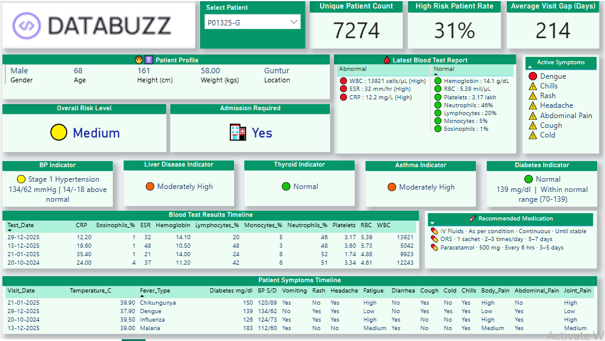

# 🏥 Databuzz Patient Diagnostic Dashboard



## 🔍 Dashboard Overview
The Power BI dashboard tracks **7,274 unique patients** with a **31% high-risk rate** and an average visit gap of **214 days**. It covers blood test timelines, symptom tracking, disease indicators (Liver, Thyroid, Asthma, Diabetes, BP), and recommended medications per patient visit.

---

## 🧹 Data Cleaning Steps

### 👤 Patient Profile Standardization
- **Profile Sync:** Standardized `gender` and `height_cm` across all historical visits using the **latest record as the Source of Truth** since these are static biological traits that should not fluctuate across visits.
- **Age Recalculation:** Recalculated historical `age` dynamically based on year-gap from visit date (e.g., a patient aged `48` in `2026` is correctly back-calculated to `46` in `2024`).

### 🗑️ Garbage Record Removal
- Dropped biologically implausible records such as:
  - `age = 2` with `height_cm = 170` physically impossible combination
  - Extreme outliers where static fields (gender, height) **shifted between visits** for the same patient ID indicating data entry errors or record mismatches
- These records were logged before deletion for audit purposes.

### 🆔 Patient ID Deduplication (UID Creation)
- Identified cases where the **same Patient ID was shared across different cities**
- Resolved by appending a **city suffix** to create a unique identifier:
```
P00342        →    P00342-VA  (Vijayawada)
                   P00342-HY  (Hyderabad)
```

- This ensures no cross-patient data contamination in visit timelines, blood reports, or symptom histories.

---

## ✅ Data Integrity Rules Applied

| Field | Rule |
|-------|------|
| `gender` | Static, taken from latest visit |
| `height_cm` | Static, taken from latest visit |
| `age` | Dynamic, recalculated per visit year |
| `weight_kg` | Visit-specific, preserved as-is |
| `temperature_c` | Visit-specific, preserved as-is |
| `patient_id` | Suffixed by city code for uniqueness |

---

## 📊 Impact on Dashboard
- Eliminated misleading patient profiles from KPI cards (Unique Patient Count, High Risk Rate)
- Blood Test Timeline and Symptom Timeline now reflect **clean, chronologically consistent** records per patient
- Disease indicators (Diabetes, Thyroid, Asthma etc.) now compute correctly without garbage age/height skewing risk logic

---

## 🔖 Notes
- Raw uncleaned data preserved in a separate `_raw` table for reference
- UID mapping table (`patient_id_mapping.csv`) maintained for traceability
- Cleaning logic documented in Power Query M steps

---

> **Dashboard:** Databuzz Patient Diagnostic Dashboard  
> **Date:** April 2026  
> **Tool:** Power BI + Power Query
